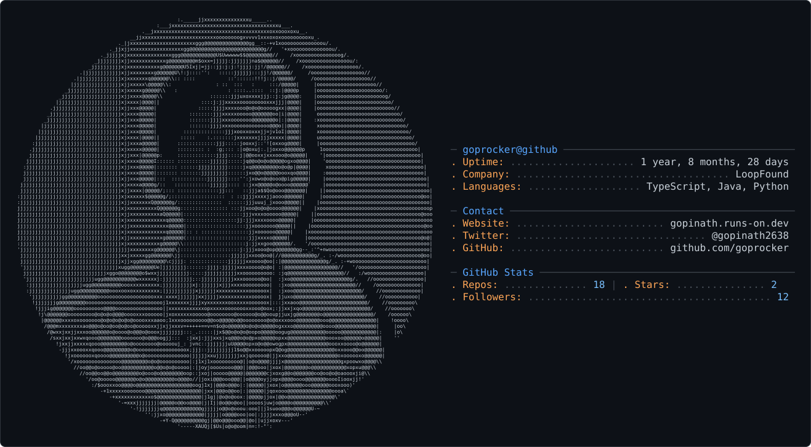

<div align="center">

<br/>

<picture>
  <source media="(prefers-color-scheme: dark)" srcset="dark_mode.svg" />
  <source media="(prefers-color-scheme: light)" srcset="dark_mode.svg" />
  
</picture>

<br/><br/>

<p align="center">
  <a href="#01--current-state"><code>// STATE</code></a> &nbsp;·&nbsp;
  <a href="#02--selected-work"><code>// SELECTED WORK</code></a> &nbsp;·&nbsp;
  <a href="#03--engineering-loadout"><code>// LOADOUT</code></a> &nbsp;·&nbsp;
  <a href="#04--system-telemetry"><code>// TELEMETRY</code></a> &nbsp;·&nbsp;
  <a href="#05--contact"><code>// CONTACT</code></a>
</p>

</div>

---

### `POSITIONING`

> **Computer Science & AI student, agency co-founder, and full-stack software developer.**
> 
> *"I build products that actually ship and solve real-world problems for real people — focusing on speed, clean architecture, and practical execution."*

---

## `01 // CURRENT STATE`

<table>
<tr>
<td width="50%" valign="top">

### 📍 Profile Context

- **Name:** Gopinath (goprocker)
- **Role:** CSE Student (AI Specialization) &amp; Student Founder
- **Agency:** Co-Founder at [LoopFound](https://loopfound.in)
- **Location:** Chennai, India
- **Stage:** 18-year-old student founder shipping client web apps and production software.

```text
OPERATING VECTOR
────────────────
Agency Systems        · Web dev, client UX & deployments
Full-Stack Web        · React, Next.js, Node.js & MongoDB
AI Engineering        · Machine Learning & Claude/Gemini APIs
Product Engineering   · Shipping real apps for 1,000+ users
```

</td>
<td width="50%" valign="top">

### ⚡ Active Focus Matrix

```text
BUILDING (In Active Production)
├── LoopFound Agency  [Shipping real client web applications]
├── P2PSkill Platform [Peer-to-peer skill exchange system]
└── QR Attendance App [Attendance engine serving 1,000+ users]

LEARNING (Deepening Engineering Core)
├── Advanced AI / ML  [Neural networks, Computer Vision & LLMs]
├── System Architecture[Scalable backends, caching & DB design]
└── Core Fundamentals [Data Structures & Algorithms in C++/Python]
```

</td>
</tr>
</table>

---

## `02 // SELECTED WORK`

Flagship platforms and systems demonstrating full-stack engineering, client execution, and real user adoption.

---

### `01. LOOPFOUND` · `ONLINE`

**A modern web development agency delivering high-performance digital products for real businesses.**

> Co-founded to bridge the gap between business goals and modern web tech. LoopFound builds scalable, fast, and responsive web platforms tailored for real client needs.

<p align="center">
  <a href="https://loopfound.in" target="_blank">
    
  </a>
</p>

**`STACK:`** `React` · `Next.js` · `TypeScript` · `TailwindCSS` · `Node.js` · `Vercel` · `Cloudflare`

<details>
<summary><kbd>▶</kbd> <strong>Deep Technical Notes & Agency Execution</strong></summary>
<br/>

- **Performance-First Delivery:** Engineered client architectures prioritizing Core Web Vitals (LCP, CLS) through SSR and static rendering optimizations.
- **Client Deployment Pipeline:** Streamlined deployment workflows leveraging Vercel and Netlify for fast iteration and automated CI/CD.
- **Business Integration:** Built modular UI components allowing quick client customizations while keeping codebases maintainable.

</details>

---

### `02. P2PSKILL` · `ONLINE`

**A peer-to-peer skill exchange platform designed to enable collaborative learning.**

> Built in collaboration with my WiCyS club team, P2PSkill allows users to trade knowledge, showcase skillsets, and find learning partners seamlessly without monetary barriers.

<p align="center">
  
</p>

**`STACK:`** `React` · `Node.js` · `Express` · `MongoDB` · `TailwindCSS` · `Firebase Auth`

<details>
<summary><kbd>▶</kbd> <strong>Deep Technical Notes & Platform Design</strong></summary>
<br/>

- **User Matching Engine:** Implemented skill-indexing logic to pair users based on requested vs. offered competencies.
- **Real-Time Communication:** Structured modular API endpoints for messaging, request tracking, and session scheduling.
- **Authentication & Security:** Integrated secure OAuth and session management for peer verification.

</details>

---

### `03. QR ATTENDANCE SYSTEM` · `DEPLOYED`

**A high-concurrency QR code attendance application serving over 1,000 active users.**

> Designed to streamline event and classroom check-ins, eliminating manual attendance taking through instant QR scanning, real-time validation, and database synchronization.

<p align="center">
  
</p>

**`STACK:`** `JavaScript` · `Node.js` · `MongoDB` · `HTML5/CSS3` · `QR Engine`

<details>
<summary><kbd>▶</kbd> <strong>Deep Technical Notes & Scalability</strong></summary>
<br/>

- **Fast Verification:** Optimized payload payloads and token validation to achieve sub-second check-in scans.
- **Duplicate Prevention:** Implemented atomic database transactions and anti-replay scanning tokens to ensure data integrity during peak usage.
- **User Scale:** Successfully handled continuous concurrent scans from 1,000+ users during live campus events.

</details>

---

## `03 // ENGINEERING LOADOUT`

### 💻 `LANGUAGES`


### 🌐 `WEB & FRAMEWORKS`


### ⚙️ `BACKEND & DATABASES`


### 🤖 `AI & DATA SCIENCE`


### 🛠️ `DEVOPS & INFRASTRUCTURE`


### 🎨 `DESIGN & CREATIVE MEDIA`


---

## `04 // SYSTEM TELEMETRY`

<div align="center">

### `📈 COMMIT & STREAK ANALYTICS`

<p align="center">
  
  &nbsp;&nbsp;
  
</p>

<br/>

### `🔠 LANGUAGE DISTRIBUTION`

<p align="center">
  
</p>

<br/>

### `🏆 EARNED TROPHIES`

<p align="center">
  
</p>

<br/>

### `📌 FEATURED REPOSITORY`

<p align="center">
  
</p>

<br/>

### `💭 TERMINAL QUOTE`

<p align="center">
  
</p>

</div>

---

## `05 // CONTACT`

<div align="center">

  <a href="https://linkedin.com/in/gopinath2638" target="_blank">
    
  </a>
  <a href="https://x.com/gopinath2368" target="_blank">
    
  </a>
  <a href="https://www.instagram.com/goprocker_photography_/?hl=en" target="_blank">
    
  </a>
  <a href="mailto:gopinath2638@gmail.com">
    
  </a>

  <br/><br/>

  <a href="https://visitcount.itsvg.in">
    
  </a>

  <br/><br/>
  
  <code>// "Building the future, one line of code at a time."</code>

</div>
